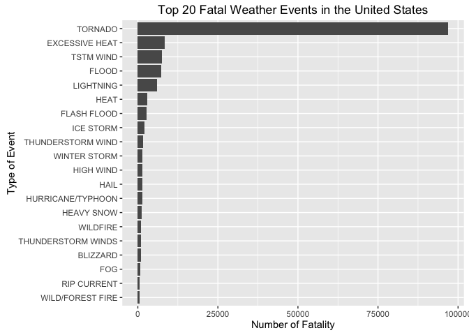

# Weather Event's Impact on Population Health and Ecnomics in United States of America
Chuk Yong  
20 July 2016  

Reproducible Research Peer Assessment 2

## Synopsis
Storms and other severe weather events can cause both public health and economic problems for communities and municipalities. Many severe events can result in fatalities, injuries, and property damage, and preventing such outcomes to the extent possible is a key concern.

This project involves exploring the U.S. National Oceanic and Atmospheric Administration's (NOAA) storm database from 1950-2011.  The results suggest that the weather event most harmful to population health was tornado, while the weather event that caused the greatest economic damage was Flood.

### Data Processing

Load and Read in the storm data set.

```r
setwd("~/Desktop/Rstudio/RepData_PeerAssessment2")
Data <- read.csv("repdata-data-StormData.csv")
```

Load the neccessary libraries

```
## 
## Attaching package: 'dplyr'
```

```
## The following objects are masked from 'package:stats':
## 
##     filter, lag
```

```
## The following objects are masked from 'package:base':
## 
##     intersect, setdiff, setequal, union
```

Extract data for the top 20 weather events that caused the most fatality

```r
FataData <- Data %>% group_by(EVTYPE) %>% summarise(FATAL=sum(FATALITIES)+sum(INJURIES)) %>% arrange(desc(FATAL))
FataDataClean <- FataData[1:20,]
FataDataClean$EVTYPE <- factor(FataDataClean$EVTYPE, levels = FataDataClean$EVTYPE[order(FataDataClean$FATAL)])
```

Extract data for the top 20 weather events that caused the most economic damage


```r
EconData <- Data %>%
  filter(PROPDMG>0 | Data$CROPDMG>0) %>%
  select(EVTYPE,PROPDMG,PROPDMGEXP,CROPDMG,CROPDMGEXP) %>%
  mutate(PROPDMG = PROPDMG*(ifelse(PROPDMGEXP == "K",1000, ifelse(PROPDMGEXP == "M",1000000,ifelse(PROPDMGEXP == "B",1000000000,1))))) %>%
  mutate(CROPDMG = CROPDMG*(ifelse(CROPDMGEXP == "K",1000, ifelse(CROPDMGEXP == "M",1000000,ifelse(CROPDMGEXP == "B",1000000000,1))))) %>%
  mutate(TOTDMG = PROPDMG+CROPDMG)

EconDataSum <- EconData %>% group_by(EVTYPE) %>% 
  summarise(TOTECONDMG = sum(TOTDMG)) %>%
  arrange(desc(TOTECONDMG)) %>%
  slice(1:20)
```

## Results of the study

###Which types of weather event were most harmful to population health?

<!-- -->

> From the graph, the most fatal weather event was tornado. The fatality rate caused by tornado far exceeded the other weather events.

----------------------------------------------------------

### Which types of weather event had the greatest economic impact?

<!-- -->

> The weather event that caused the most economic damage is flood, followed by hurricane/typhoon, tornado and storm surge.
